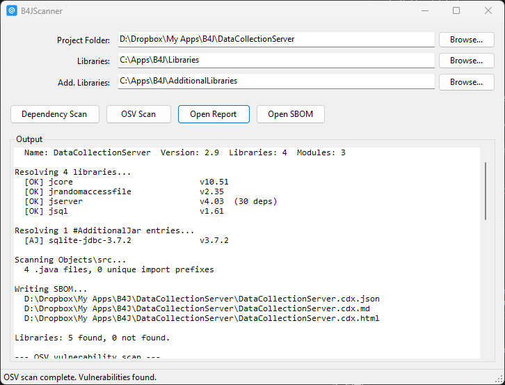
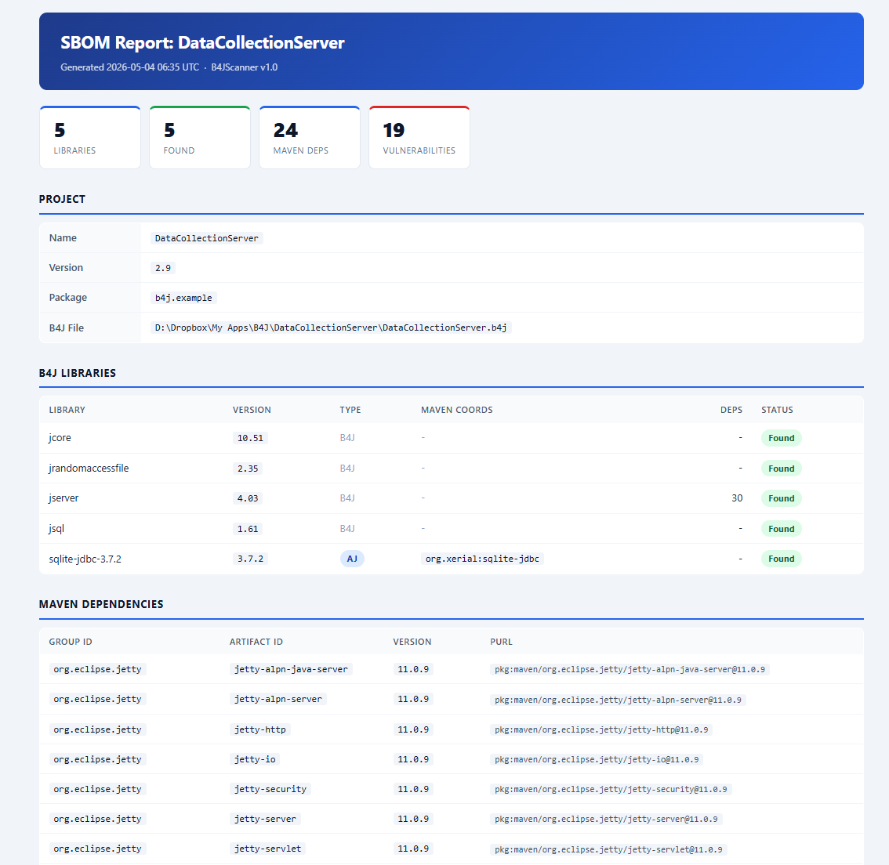

# B4JScanner

A Windows desktop tool that scans a [B4J](https://www.b4x.com/b4j.html) project and produces a Software Bill of Materials (SBOM) report. It identifies all library dependencies, resolves their versions, discovers underlying Maven JARs, generates an HTML report, and can run a vulnerability check via OSV Scanner.



---

## Getting Started

### Requirements

- Windows with .NET Framework 4.7.2 or later
- B4J Libraries folder (typically `C:\Apps\B4J\Libraries`)
- B4J AdditionalLibraries folder (typically `C:\Apps\B4J\AdditionalLibraries`)

### Building

```cmd
build.cmd
```

This invokes `csc.exe` directly from the .NET Framework folder and produces `B4JScanner.exe`. No IDE, no `.sln` or `.csproj` files, no NuGet packages, and no external dependencies are required.

### Running

Double-click `B4JScanner.exe`. The last-used folder paths are saved to `b4jscanner.cfg.json` (next to the exe) and restored on next launch.

---

## UI Overview

| Field | Purpose |
|-------|---------|
| Project Folder | Path to the B4J project folder (containing the `.b4j` file) or the `.b4j` file itself |
| Libraries | Path to the main B4J Libraries folder |
| Add. Libraries | Path to the AdditionalLibraries folder |

Buttons (left to right):

| Button | When enabled | Action |
|--------|-------------|--------|
| **Dependency Scan** | Always | Parses the project, resolves all libraries, writes `.cdx.json`, `.md`, and `.html` output files |
| **OSV Scan** | After Dependency Scan | Runs `osv-scanner` against the SBOM and regenerates the HTML report with vulnerability findings |
| **Open Report** | After Dependency Scan | Opens the HTML report in the default browser |
| **Open SBOM** | After Dependency Scan | Opens the raw `.cdx.json` file |

### Typical workflow

1. Select folders and click **Dependency Scan**
2. Click **Open Report** to view the HTML report immediately
3. Optionally click **OSV Scan** to add vulnerability data, then refresh the browser

---

## How Dependency Discovery Works

### Step 1 - Parse the B4J Project File

The `.b4j` file is plain text. B4JScanner reads it in two passes.

**Header section** (before `@EndOfDesignText@`):

| Pattern | Extracts |
|---------|---------|
| `Library{n}=name` | Each declared library name |
| `Module{n}=name` | Module names (for reference) |
| `Build1=pkg,namespace` | Java package/namespace |
| `Version=x.y` | Project version |

**Code section** (after `@EndOfDesignText@`):

Scans every line for `#AdditionalJar:` compiler directives.

### Step 2 - Scan .bas Module Files

All `.bas` files under the project folder are also scanned for `#AdditionalJar:` directives. Duplicates across all files are removed.

```
#AdditionalJar: sqlite-jdbc-3.51.0.0_min
#AdditionalJar: bcprov-jdk18on-1.80
```

These are treated the same as regular libraries for resolution and version extraction, and appear in the report with an **AJ** badge.

---

## How Libraries Are Located

For each library name (e.g. `hikaricp`, `jserver-11.0.21`, `json`), the following strategies are tried in order, first in the **Libraries** folder then in the **AdditionalLibraries** folder:

### Strategy 1 - Exact name match

Looks for `{name}.jar` (case-insensitive).

```
Libraries\Json.jar            <- matches "json"
Libraries\HikariCP.jar        <- matches "hikaricp"
```

### Strategy 2 - Versioned subdirectory

Strips the trailing version segment from the library name and checks a subdirectory named after the base.

```
Libraries\jserver\jserver-11.0.21.jar    <- matches "jserver-11.0.21"
Libraries\jserver\jserver.jar            <- also tried
```

Version stripping: `jserver-11.0.21` becomes `jserver` by finding the last `-` where the following character is a digit.

### Strategy 3 - Prefix match

Finds any JAR in the directory (or one level of subdirectories) whose filename starts with the library name.

```
Libraries\HikariCP-2.4.6.jar                          <- matches "hikaricp"
Libraries\commons-codec\commons-codec-1.16.1.jar      <- matches "commons-codec"
```

### B4XLib fallback

If no JAR is found, B4JScanner looks for `{name}.b4xlib` in both directories.

---

## How Versions Are Extracted

Once a JAR is located, version information is extracted using these sources in priority order:

### 1. B4J XML Sidecar

Every B4J wrapper library ships a `.xml` file alongside its JAR. B4JScanner reads the `<version>` child element from the XML root:

```xml
<root>
  <version>2.5.1</version>
  <dependsOn>hikaricp-5.1.0/HikariCP-5.1.0.jar</dependsOn>
</root>
```

This is the most reliable source for B4J wrapper libraries.

### 2. JAR MANIFEST.MF

Opens the JAR as a ZIP and reads `META-INF/MANIFEST.MF`. Checks these keys in order:

- `Implementation-Version`
- `Bundle-Version`
- `Specification-Version`

Also extracts `Implementation-Vendor`, `Implementation-Title`, and `Bundle-Description` for metadata.

### 3. JAR Filename

Extracts a version segment from the JAR filename using the pattern `[-_](\d+[\.\d]*\w*)`:

```
HikariCP-2.4.6.jar            -> 2.4.6
sqlite-jdbc-3.51.0.0_min.jar  -> 3.51.0.0_min
```

### 4. Library Name

If the library name itself contains a version suffix (same pattern), that is used:

```
jserver-11.0.21  -> 11.0.21
```

---

## How Maven Coordinates Are Identified

Real Maven coordinates (group ID, artifact ID, version) are read from `META-INF/maven/*/pom.properties` inside the JAR. Example entry:

```properties
groupId=com.zaxxer
artifactId=HikariCP
version=5.1.0
```

These produce a proper PURL: `pkg:maven/com.zaxxer/HikariCP@5.1.0`

If no `pom.properties` is found, the component is labelled as a B4J wrapper: `pkg:maven/b4j/{name}@{version}`

---

## How Underlying Dependencies Are Resolved

The B4J XML sidecar can declare underlying JAR dependencies via `<dependsOn>` elements:

```xml
<dependsOn>jserver-11.0.21/jetty-server-11.0.21.jar</dependsOn>
<dependsOn>hikaricp-5.1.0/HikariCP-5.1.0.jar</dependsOn>
```

For each dependency B4JScanner:

1. Constructs the expected path (e.g. `Libraries\jserver-11.0.21\jetty-server-11.0.21.jar`)
2. Falls back to a flat filename search in the root of each library directory
3. Reads `pom.properties` from inside the found JAR to get real Maven coordinates
4. Adds the dependency as a separate SBOM component with a `pkg:maven` PURL

Dependencies are deduplicated by PURL across all libraries.

---

## Java Source Scanning

B4JScanner scans `{ProjectFolder}\Objects\src\` recursively for all `.java` files. From each file it extracts:

- The `package` declaration
- All `import` statements

The following namespaces are filtered out as they are B4J framework or standard library internals:

- `anywheresoftware.*`
- `java.*`
- `javax.*`
- `android.*`

The remaining imports are collapsed to their two-segment prefix (e.g. `com.zaxxer`, `org.eclipse`) and listed in the SBOM and HTML report as external references. This gives visibility into third-party Java packages used directly in any custom Java code in the project.

---

## Output Files

All three files are written to the project folder after a Dependency Scan.

### `{ProjectName}.html`

A self-contained HTML report viewable in any browser.



Sections:

- Summary cards (Libraries, Found, Not Found, Maven Deps, Vulnerabilities)
- Project info
- B4J Libraries table with version, type (B4J or AJ), Maven coords, dependency count, and Found/Missing status
- Maven Dependencies table with PURLs
- Vulnerabilities (populated after running OSV Scan)
- Java import prefixes

### `{ProjectName}.cdx.json`

A [CycloneDX 1.5](https://cyclonedx.org/specification/overview/) JSON SBOM. Contains:

- Project metadata (name, version, Java package)
- One component per B4J library with PURL, version, vendor, and B4J-specific properties
- One component per resolved Maven dependency (deduplicated)
- External references for Java import prefixes found in `Objects/src`

B4J-specific properties on each component:

| Property | Value |
|---------|---------|
| `b4j:libraryName` | Original name as declared in the project |
| `b4j:found` | `true` / `false` |
| `b4j:jarPath` | Absolute path to the resolved JAR |
| `b4j:xmlPath` | Absolute path to the sidecar XML (if found) |
| `b4j:b4xlibPath` | Absolute path to the .b4xlib (if used) |
| `b4j:versionSource` | Where the version came from (`xml`, `manifest:*`, `filename`, `library-name`) |
| `b4j:dependsOn` | Repeated for each underlying dependency name |

### `{ProjectName}.md`

A Markdown report with the same content as the HTML report (without vulnerability data).

---

## Vulnerability Scanning

Click **OSV Scan** after a Dependency Scan. B4JScanner looks for `osv-scanner` in this order:

1. Any file matching `osv-scanner*` in the same folder as `B4JScanner.exe`
2. `osv-scanner` on the system PATH

The scanner is invoked with JSON output so results can be embedded in the HTML report:

```
osv-scanner --format json -L "{ProjectName}.cdx.json"
```

The file must have the `.cdx.json` extension (required by osv-scanner). Download osv-scanner from [https://github.com/google/osv-scanner/releases](https://github.com/google/osv-scanner/releases) and place the `.exe` next to `B4JScanner.exe`.

After the scan completes, the HTML report is regenerated with a structured vulnerability table showing severity badges (CRITICAL, HIGH, MEDIUM, LOW) for each affected package. Refresh the browser to see the updated report.

---

## Configuration File

`b4jscanner.cfg.json` is saved next to `B4JScanner.exe` automatically. It stores the last-used folder paths so they are pre-filled on next launch.

```json
{
  "projectFolder": "D:\\Projects\\MyApp",
  "librariesPath": "C:\\Apps\\B4J\\Libraries",
  "additionalLibrariesPath": "C:\\Apps\\B4J\\AdditionalLibraries"
}
```
